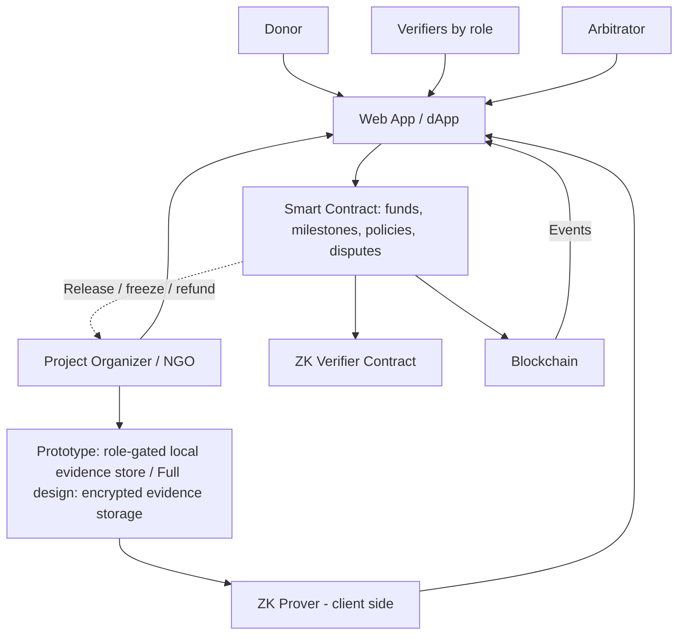

# Proof of Aid — Architecture

## Summary

Proof of Aid is a milestone-based funding system for donations to an NGO dedicated to the **comprehensive protection of children against abuse**. Donors can follow how funds progress and verify program-level accountability **without exposing children or safeguarding cases**. The platform is for funding transparency; it is not a case-management, reporting, investigation, emergency-response, or child-facing service.

The system combines:

- **A smart contract** that holds donated funds and releases them in chained tranches, one milestone at a time.
- **Role-based verification**: each type of expense requires confirmation from specific independent parties (for example, an independent safeguarding verifier and a program auditor).
- **Zero-Knowledge Proofs (ZKPs)** to prove that private support costs stay within a public limit, without revealing the individual line items.
- **A blockchain** as a permanent, auditable record of donations, releases, verifications, disputes and refunds.
- **Off-chain storage** for approved, non-identifying program and financial evidence; child case data is prohibited.

> **Core principle: money follows verified progress, while sensitive evidence stays private.**
>
> ZK proves rules without revealing data, the blockchain records the history, and the smart contract controls the money.

### Focus of our implementation

> Within our complete Proof of Aid design, we focus on **Trust, Evidence & Privacy** and **Funding**, addressing the tension between donor transparency and the privacy of sensitive project data through **chained milestone funding, per-expense-type multi-party verification, a zero-knowledge proof for private support costs, and a dispute mechanism**.

---

## Vision and actors

### Vision

Donors should not have to choose between transparency and privacy. Instead of trusting that a project will eventually deliver, the donor can see which milestone their money is in, who verified each step, and cryptographic proof that the agreed rules were met. The people involved (staff, partner organizations, and children) keep their privacy.

### Actors

| Actor | Responsibilities |
| --- | --- |
| **Donor** | Funds a project. Follows their donation and the state of every milestone. Can open a dispute. Can reclaim their share of locked funds if the project fails |
| **Project Organizer (NGO)** | Creates the project and its milestones. Starts milestones, spends released funds, submits evidence, generates the ZK proof for support costs, responds to disputes |
| **Verifier** | An independent party with a specific **role** (sender, receiver, supplier, site manager, independent engineer, auditor). Confirms or rejects the part of a claim that falls within their role |
| **Arbitrator** | Resolves disputes. In the prototype this is a single role assigned by the admin; in the full design it would be a committee or a vote |
| **Children and families served** | People whose safety and privacy are paramount. They do not use the prototype or submit information to this platform; service delivery is represented only through non-identifying program-level attestations |
| **Smart contract** | Holds funds, enforces milestone rules, tracks state, releases or freezes funds, emits events |
| **Blockchain** | Shared, tamper-resistant record of everything the contract does |

No child-identifying information, disclosures, referrals, case records, images, audio, or personal information is stored on-chain or in this platform. Safeguarding cases remain in the NGO’s separate approved safeguarding system.

---

## Fund release model: chained tranches

Funds are released **before** a milestone is verified, because the NGO needs the money to do the work. Verification does not decide whether *this* milestone is paid; it decides whether the **next** one is.

1. Milestones are funded in order. A milestone can start once its full budget has been raised.
2. When the project starts, the contract releases the funds of **milestone 1** to the organizer.
3. When milestone *k* is verified, the contract releases the funds of milestone *k+1*.
4. The maximum amount ever at risk (released but not yet verified) is **one milestone**.

### Example: a €100,000 child-protection program

| Milestone | Condition | Budget |
| --- | --- | --- |
| M1 | Safeguarding policy, designated focal point, and staff/partner checks and training independently attested | €20,000 |
| M2 | Safe referral and response capability reviewed and ready (no case records shared) | €20,000 |
| M3 | Prevention and family-support program delivered; aggregate activity attested with small-group suppression | €30,000 |
| M4 | Program operations and use of funds independently reviewed; support-cost cap proven | €30,000 |

| Moment | Locked | Released, unverified | Released, verified |
| --- | --- | --- | --- |
| Project fully funded | 100,000 | 0 | 0 |
| M1 starts (M1 released) | 80,000 | 20,000 | 0 |
| M1 verified, M2 released | 60,000 | 20,000 | 20,000 |
| M2 verified, M3 released | 30,000 | 30,000 | 40,000 |
| M3 verified, M4 released | 0 | 30,000 | 70,000 |
| M4 verified | 0 | 0 | 100,000 |

Every row satisfies the fund invariant. These buckets are mutually exclusive: frozen funds are excluded from the normally available locked balance.

```text
Donated = Locked + Released(unverified) + Released(verified) + Frozen + Refunded
```

For example, after M1 is verified: 60,000 + 20,000 + 20,000 = 100,000.

### Milestone states

```text
LOCKED ──> RELEASED ──> EVIDENCE_SUBMITTED ──> VERIFIED   (unlocks the next milestone)
              │                │                   │
              └────────────────┴───────────────────┴──> DISPUTED
                                                           │
                                             ┌─────────────┴─────────────┐
                                             ▼                           ▼
                                      RESOLVED_VALID              RESOLVED_INVALID
                                  (unfreeze, continue)      (locked funds refunded pro rata)
```

### Following a donation

Donations fill the milestones in order of arrival. Each donation occupies a range on a cumulative funding line, and the range that overlaps a milestone's budget is the part of the donation assigned to it.

Example: a €100 donation arrives when €19,950 has been raised, so it occupies `[19,950, 20,050)`. M1 ends at 20,000:

```text
Part in M1: 20,000 − 19,950 = 50   (released and verified)
Part in M2: 20,050 − 20,000 = 50   (locked or in use)
Check: 50 + 50 = 100
```

The donor sees where each part of their donation is and what state it is in.

If a project fails, each donor can reclaim only the part of their donation still allocated to locked/frozen milestone budgets; already released tranches cannot be reclaimed. Calculate the remaining allocation by intersecting the donor’s cumulative donation range with the ranges of milestones that remain locked. In the simple proportional example, a donor who contributed 1% of a fully funded €100,000 project and still owns 1% of the €60,000 locked pool reclaims **€600**.

---

## End-to-end flow

```text
                    CREATE PROJECT AND MILESTONES
                                |
                                v
                      DONORS FUND THE PROJECT
                     (funds locked in the contract)
                                |
                                v
                    MILESTONE k STARTS: FUNDS RELEASED
                                |
                                v
                     WORK HAPPENS, EVIDENCE COLLECTED
                     (stored off-chain, hash registered)
                                |
                                v
                  ROLE-BASED CONFIRMATIONS + ZK PROOF
                    (private support costs proven
                        within a public limit)
                                |
                       ┌────────┴────────┐
                       v                 v
                   VERIFIED           DISPUTED
                       |                 |
                       v                 v
              MILESTONE k+1        REMAINING FUNDS
             FUNDS RELEASED           FROZEN
                       |                 |
                       |          ARBITRATOR DECIDES
                       |            /            \
                       |        VALID          INVALID
                       |          |               |
                       |          v               v
                       |       CONTINUE     REFUND LOCKED FUNDS
                       |          |         TO DONORS (PRO RATA)
                       +----------+
                                |
                                v
                        PROJECT COMPLETE
```

---

## Verification model

### Two kinds of verification

| Kind | Performed by | What it checks |
| --- | --- | --- |
| **Mathematical** | The smart contract (ZK verifier) | That the committed private data satisfies the public rule |
| **Real-world** | Independent parties with defined roles | That the underlying events and data are authentic |

A ZK proof shows that a rule was applied correctly to some data. It does **not** show that the data is true. That is why real-world verification by independent parties is required.

### Verification policies per expense type

Each expense type has a public **verification policy**: the evidence required and the roles that must confirm. The claim is verified only when the full policy is satisfied.

| Expense type | Evidence | Required confirmations |
| --- | --- | --- |
| Safeguarding readiness | Approved policy, role/training completion attestations, partner due-diligence summary (no names of children or case records) | Independent safeguarding verifier + NGO |
| Safe referral capability | Process-level assessment and remediation attestation; no referral details or small-cell counts | Independent safeguarding verifier |
| Prevention and family-support activities | Program-level, aggregated delivery attestation with low-count suppression | Independent program verifier + Auditor |
| Support costs (administration, safe service operations) | Private invoices and aggregate only | Auditor; only the aggregate is proven with ZK |

Adding a new expense type means adding a new policy. The contract logic does not change.

### Example: a program-level safeguarding milestone

```text
1. The NGO submits approved policy and program-operation artifacts that contain no child case information.
2. The evidence bundle is hashed (keccak256); only the hash and a generic claim category are registered on-chain.
3. An independent safeguarding verifier attests to the agreed readiness criteria.
4. A separate auditor confirms the financial claim where the policy requires it.
5. The policy is satisfied only when the required independent roles confirm the same commitment.
6. Rejections can open a dispute; reason codes and public events must not contain identifying details.
```

### Rules

- Confirmations must come from **different wallets belonging to different organizations**.
- Expenses above a configurable amount additionally require an **independent auditor**.
- A rejection by any required role immediately opens a dispute.
- Every confirmation and rejection is recorded as an on-chain event.

### Claim states

Every expense claim has an explicit, shared state. State changes happen only through authorized transactions, and each one emits an event.

```text
                  authorized verifiers (as required by the policy)
DECLARED ───────────────────────────────────────────────────> VERIFIED
    │                                                             │
    │  a required verifier rejects, or an authorized              │  an authorized actor
    │  actor opens a dispute                                      │  opens a dispute
    ▼                                                             ▼
DISPUTED <────────────────────────────────────────────────────────┘
    │
    ├──> RESOLVED_VALID     (the claim becomes VERIFIED)
    └──> RESOLVED_INVALID   (remaining locked funds are refunded)
```

| Transition | Who is authorized | What the contract checks |
| --- | --- | --- |
| Claim is declared with its evidence hash | The organizer wallet of the project | Organizer role; the milestone has been released |
| DECLARED → VERIFIED | Wallets holding the roles required by the policy | Role registry; confirmations come from different organizations; all confirm the same hash |
| DECLARED or VERIFIED → DISPUTED | A required verifier (by rejecting) or a donor of the project | Role registry, or an existing donation record for that project |
| DISPUTED → RESOLVED | The arbitrator | Arbitrator role |

The contract applies rules; it does not observe the physical world. It cannot know whether the food arrived, only that the authorized parties said so.

### Public vs. private expenses

- **Impact expenses** (food delivered, foundations built) are **public** and verified by several parties. This is what donors want to see.
- **Support costs** (cleaning, website, administration) stay **private**. Only their aggregate is proven, with ZK, to stay within a public limit.

Example, child-protection program milestone with a €10,000 budget:

```text
Program delivery: 9,500  attested at aggregate level by independent roles
              ------
Public total: 9,500

Support costs (private): 500
Allowed limit: 10% of 10,000 = 1,000
ZK proof: 500 <= 1,000  (line items are not revealed)

Check: 9,500 + 500 = 10,000
```

---

## Child safeguarding and data minimization

This project supports an NGO working across prevention, safe response, and recovery from child abuse. The product provides **funding and program accountability**; it must not become a channel for a child to disclose abuse or for staff to manage, investigate, or refer individual cases. No child-facing accounts, forms, chat, uploads, or case workflow are in scope.

- **Never collect or upload** a child’s name, contact details, image, voice, precise location, identifying story, disclosure, referral, health or case record, or information that could identify a family. This applies to evidence, filenames, metadata, logs, analytics, dispute details, and on-chain events. All platform roles, including the NGO and arbitrator, are subject to this boundary.
- The NGO handles disclosures and individual safeguarding cases only in its separate, approved safeguarding and incident-response system, with trained personnel and its own access and retention controls. Proof of Aid receives at most a non-identifying attestation that an agreed process or program-level milestone was reviewed.
- Permitted evidence is limited to organizational policy, redacted financial records, partner due-diligence summaries, staff/partner training-completion attestations, and independent program-level audit artifacts. Remove names and identifying metadata before hashing or upload.
- Public reporting must use aggregated information and suppress small groups, rare events, precise dates/locations, and combinations that could reveal a child’s identity. A hash or ZK proof does not make identifying source material safe to publish.
- ZK proves only that committed support-cost amounts meet the configured limit. It does not prove that a child received help, that a safeguarding response was safe, or that source documents are truthful. Independent safeguarding and financial verification remain necessary.
- Before production use, the NGO must have an approved safeguarding policy, a designated safeguarding focal point, safe reporting and response procedures, and appropriate staff/partner screening and training. These controls follow the four areas in [Keeping Children Safe’s International Child Safeguarding Standards](https://www.keepingchildrensafe.global/international-child-safeguarding-standards/) and a risk-based approach such as [UNICEF’s Safeguarding Policy](https://www.unicef.org/documents/safeguarding-policy). This architecture is not a legal or safeguarding audit.

A dispute may freeze later funding tranches. Before production, the NGO and arbitrator need a rapid review and continuity plan so a financial dispute does not interrupt essential protection services.

## Evidence and privacy model

### What goes where

| On-chain | Off-chain (encrypted) |
| --- | --- |
| Donations, milestones, states | Redacted invoices, approved program audit artifacts |
| Evidence hashes and commitments | Child case records, disclosures, referrals, identities, images, audio, precise locations or identifying narratives (prohibited; not stored) |
| Confirmations, rejections, disputes | Support-cost line items |
| ZK verification results | Anything that may need to be corrected or deleted |
| Fund movements and timestamps | |

### Evidence integrity

1. The evidence file is stored off-chain, encrypted.
2. Its hash (`keccak256`) is registered on-chain.
3. Anyone with access to the file can recompute the hash and check that it matches, so any later modification is detected.

A hash proves the file has not changed since registration. It does **not** prove that the file was truthful when registered.

### ZK proof for private support costs

The proof states: *the sum of the private support costs does not exceed the allowed share of the milestone budget.*

| | Data |
| --- | --- |
| **Private inputs** | The support-cost line items (amounts) and a random salt |
| **Public inputs** | A commitment `C` to the private data, the milestone budget, the maximum share (in basis points, for example 1000 = 10%) |
| **The circuit checks** | `sum(items) * 10000 <= maxShare * budget`, and that `C` is the correct commitment to the items and salt |

The **auditor** reviews the private invoices and signs the commitment `C`, attesting that the data is authentic. The contract then checks both the auditor's signature and the ZK proof. The proof guarantees the rule was applied correctly; the auditor guarantees the data is real.

Privacy notes:

- A random **salt** is included in the commitment so that low-entropy data cannot be guessed by brute force.
- A ZK-friendly hash (Poseidon) is used inside the circuit; `keccak256` is used for evidence files.
- If IPFS is used, files are **encrypted before upload**, because IPFS is public by default.
- Donor wallets are pseudonymous but public. Linking a wallet to a real identity, when needed (for example tax receipts), happens off-chain.

---

## Identity, wallets and access control

A **wallet** is a key pair that controls an address. Signing a transaction proves that whoever sent it controls that wallet. It does **not** prove who the person or organization behind the wallet is.

### Verifiers and organizers

The contract keeps a **role registry**: wallet -> role(s) and wallet -> organization ID. Every state-changing function checks the caller's role (`msg.sender`) before acting, and the contract enforces that confirmations on the same claim come from different organizations.

Linking a wallet to a real-world organization happens **off-chain**, and only the result (wallet, role, organization ID) is recorded on-chain:

| Approach | How it works | Status |
| --- | --- | --- |
| Admin-assigned roles | An administrator grants roles after checking the organization off-chain | **Prototype** (explicit trust assumption) |
| Published wallet address | The organization publishes its wallet on its official website or channels, so anyone can cross-check it | Design |
| Signed challenge | The organization signs a message ("I am X, my wallet is 0x...") that the registry checks | Design |
| Verifiable credentials / attestations | An accrediting body (for example a professional college for engineers) issues a credential bound to the wallet | Design |

### Donors

Donors are **pseudonymous** wallets. No identity is required to donate.

- Donor rights come from the **on-chain donation record**, not from identity: only a wallet that donated to a project can dispute it or reclaim its share of locked funds.
- Where a real identity is needed (for example a tax receipt), the donor signs a message linking their wallet to their details. That link is stored **off-chain** by the organization, never on-chain.
- On-chain data is public. The interface may hide wallet addresses, but anyone can read them from the chain, so donors who want unlinkability should use a fresh wallet.

### Known limitation

In the prototype any donor of a project can open a dispute, which could be abused to freeze funds. Mitigations for the full design: a minimum donation share or a small deposit to dispute.

---

## Visibility: who can see what

The donor does **not** see more data than any third party. The donor has additional **rights** (dispute, refund), not additional visibility.

| Data | Any third party | Donor | Verifier | Organizer | Arbitrator |
| --- | --- | --- | --- | --- | --- |
| Donations (amounts, donor wallets, IDs) | Yes | Yes | Yes | Yes | Yes |
| Projects, milestones, budgets, states, releases, refunds, timestamps | Yes | Yes | Yes | Yes | Yes |
| Impact expense: type, amount, evidence hash | Yes | Yes | Yes | Yes | Yes |
| Who confirmed or rejected each claim, and when | Yes | Yes | Yes | Yes | Yes |
| Disputes and resolutions (with reason hashes) | Yes | Yes | Yes | Yes | Yes |
| Reputation counters | Yes | Yes | Yes | Yes | Yes |
| **Approved program/financial evidence files** | No (unless published after review) | No (unless published after review) | Only for assigned claims | Yes | Only when essential to a dispute |
| **Support-cost line items (without child data)** | No | No | Auditor only | Yes | Only when essential to a dispute |
| Support-cost total | No (only "within the limit") | No | Auditor only | Yes | Only in a dispute |
| Any child-identifying or case-level data | Prohibited throughout this platform; never uploaded, stored, logged, or placed on-chain | No | No | No | No |

What each party can verify **without** seeing the evidence:

- Anyone can check the on-chain history and recompute the fund invariant.
- Anyone can verify the ZK proof, since the verifier is public.
- Anyone who is given a file can hash it and compare with the on-chain hash.
- The organizer may publish only a reviewed, non-identifying program artifact. Never publish a child image, story, case outcome, precise location, or low-count metric.

**Access to private files.** In the prototype, files are simulated in a local store, and the store only serves a file to a wallet that proves (by signing a challenge) that it holds a role entitled to that claim. In the full design, each file is encrypted with its own key, and that key is shared only with the authorized wallets.

---

## Accountability and deadlines

Once a deadline passes, any eligible wallet can submit a transaction to mark the item overdue. A smart contract does not run by itself; the overdue state is recorded only after that transaction confirms.

| Situation | What happens |
| --- | --- |
| The NGO does not submit evidence before its deadline | The milestone is flagged **overdue**, the next tranche stays locked, and this is publicly recorded. After a long delay, donors can reclaim their share of the locked funds |
| A required verifier does not confirm before the deadline | The milestone is flagged **overdue**, a missed confirmation is recorded against that verifier's reputation, and the milestone can be escalated to the arbitrator |
| A confirmation is later overturned in a dispute | It is recorded against the verifier's reputation |
| A rejection is later found to be unjustified | It is recorded against the rejecting party's reputation |
| The NGO submits false evidence | The project is frozen, remaining locked funds are refunded, and the record is permanent |

Example timeline for a milestone (durations are configurable and much shorter in the demo):

```text
Day 0     Milestone funds released
Day 30    Deadline for the NGO to submit evidence
Day 37    Deadline for verifiers to confirm (7 days after submission)
Day 37+   Unconfirmed: flagged overdue, can be escalated to the arbitrator
Day 90    NGO still has not justified: donors can reclaim locked funds
```

**Reputation** is a set of public on-chain counters per wallet: confirmations on time, confirmations missed, and confirmations overturned.

Designed for the full system, not implemented in the prototype:

- **Stakes**: professional verifiers (auditors, engineers) and the NGO deposit a bond that is lost if their claim is overturned. Community-facing participants are **not** required to stake, so vulnerable communities are not excluded.
- **Verification fees**: a small fee (for example 0.5% of the milestone, so 100 on a 20,000 milestone, split between two verifiers) paid only for on-time confirmations.

---

## Dispute mechanism

Verification is not treated as irreversible truth.

- **Who can dispute**: any required verifier (by rejecting) and any donor of the project.
- **Effect**: the funds still **locked** are frozen. Funds already released cannot be recovered by the contract.
- **Resolution**: the arbitrator decides. If the claim is **valid**, funds are unfrozen and the project continues. If it is **invalid**, the locked funds are refunded to donors pro rata.
- **History**: nothing is overwritten. Each step adds an event recording who acted, when, why and the outcome.

---

## System diagram



### Components

| Component | Responsibility | Technology (planned) |
| --- | --- | --- |
| Web app / dApp | Role-specific views: donor tracking, organizer panel, verifier confirmations, arbitrator | Next.js, React, TypeScript, viem / wagmi |
| Smart contract | Holds funds, enforces tranches, verification policies, deadlines, disputes, refunds | Solidity, OpenZeppelin, Foundry |
| ZK circuit and verifier | Proves support costs are within the limit; verifier contract checks the proof on-chain | Circom and snarkjs (planned; confirm during implementation) |
| Blockchain | Shared audit trail | EVM testnet (Arbitrum Sepolia) |
| Evidence storage | Prototype: simulated local store with role-gated access; full design: encrypted private files. Only hashes go on-chain | Local store for prototype; encrypted storage in full system, IPFS only if encrypted |
| Wallets | Authorize actions and identify roles | MetaMask or Privy |
| Test token | Simulated money for the prototype | ERC-20 mock token |

For the prototype, the frontend reads contract events directly. A dedicated event indexer and PostgreSQL database are part of the full design (search, dashboards, notifications) but are not required to demonstrate the core flow.

---

## Smart contract model

```text
Project
├── projectId
├── organizer, arbitrator
├── totalTarget, totalDonated
├── status
└── milestones[]

Milestone
├── milestoneId
├── budget
├── fundingStart              (position on the cumulative funding line)
├── status
├── releasedAt, evidenceDeadline
├── expenses[]
│   ├── expenseType
│   ├── amount
│   ├── evidenceHash
│   └── confirmations[]       (role, wallet, timestamp)
└── supportCostCommitment, supportProofValid  (no private line-item amounts on-chain)

Policy: expenseType -> list of (required role, required count)
Donation: donationId, donor, amount, start   (position on the funding line)
```

Wallets are mapped to roles and to organizations, so the contract can enforce that confirmations come from different organizations.

Events emitted: `ProjectCreated`, `DonationCreated`, `MilestoneReleased`, `EvidenceSubmitted`, `ExpenseConfirmed`, `ExpenseRejected`, `SupportProofVerified`, `MilestoneVerified`, `MilestoneOverdue`, `DisputeOpened`, `DisputeResolved`, `RefundClaimed`.

The contract enforces financial rules. It does **not** interpret real-world evidence.

---

## Security and trust assumptions

### Cryptographic trust

The blockchain and ZK proofs provide guarantees about proof validity, transaction history, contract execution and ownership of accounts.

### Organizational trust

Real-world parties are still required to establish that evidence comes from a legitimate source, that physical work happened, and that reported figures are accurate. In the prototype, verifier roles and the arbitrator are assigned by an administrator, and this is an explicit **trust assumption**.

### The oracle problem

The blockchain cannot know whether "the foundations are completed" or "the food arrived". The system does not claim to solve this. It makes the confirmations **public, hard to forge, impossible to erase, and costly to falsify**.

### Threats and mitigations

| Threat | Mitigation |
| --- | --- |
| Fake evidence | Multi-party role-based confirmation, dispute mechanism, reputation |
| Modified evidence | Hash registered on-chain |
| Collusion between sender and receiver | Different wallets and organizations, independent auditor above a threshold, donor disputes |
| NGO collects a tranche and does not deliver | Chained tranches limit exposure to one milestone; overdue status; refund of locked funds |
| A verifier does not respond | Deadline, overdue flag, reputation record, escalation to the arbitrator |
| Malicious or unjustified dispute | Rejections require a reason; unjustified rejections affect reputation |
| Privacy leakage | Off-chain encrypted storage, ZK proof for private data, salted commitments |
| Guessing private data from hashes | Random salt in commitments |
| Compromised organizer wallet | Role-based access; multisig for high-value actions (full design) |
| Lost private data | Redundant encrypted storage (full design) |

---

## Decisions and trade-offs

| Decision | Rationale | Trade-off / alternative |
| --- | --- | --- |
| Release funds before verification | The NGO needs the money to do the work | Money already spent cannot be recovered; mitigated by chained tranches. Alternatives: smaller tranches or an NGO stake |
| Chained tranches | Caps exposure at one milestone and ties funding to verified progress | The last milestone is released before its own verification |
| Verification policies per expense type | Different facts need different witnesses | More roles to manage; needs a role registry |
| Public impact expenses, private support costs | Donors see the impact; sensitive or trivial details stay private | Donors cannot inspect individual support costs, only the guaranteed limit |
| ZK for support costs only | A small, realistic circuit that shows the privacy model | More complex than a plain auditor signature; the auditor is still needed for data authenticity |
| Evidence and personal data off-chain | Privacy and the ability to correct or delete | Requires storage and availability infrastructure |
| Hashes and commitments on-chain | Integrity without exposure | A hash does not prove truthfulness |
| Deadlines and reputation instead of stakes (prototype) | Permissionless to record after expiry; a wallet submits the transaction | Weaker deterrent than financial stakes |
| Freeze only locked funds on dispute | The only funds the contract still controls | Cannot claw back released funds |
| Events instead of edits | Complete audit history | More complex state model |
| Test token instead of real money | Avoids custody and regulation | The money layer is simulated |

---

## Prototype vs. full vision

### Prototype implementation target (planned)

- Smart contract with projects, milestones, chained tranche release and the fund invariant.
- Verification policies per expense type and role-based confirmations.
- Evidence hashing and hash-match verification.
- One ZK circuit (private support costs within a public limit) verified on-chain.
- Disputes with a simple arbitrator and pro-rata refund of locked funds.
- Deadlines with permissionless overdue marking after expiry and on-chain reputation counters (a wallet must submit the marking transaction).
- Donation tracking view built from contract events.

### Simulated

- Money (ERC-20 test token on Arbitrum Sepolia).
- Real-world identity of organizations, verifiers and the arbitrator (wallets with admin-assigned roles).
- Private-file access through a local store that checks a wallet signature and its assigned role.

### Designed only

- Stakes for professional verifiers and NGOs, and verification fees.
- Encrypted per-file keys, distributed only to authorized wallets (full system).
- Partial advance per milestone.
- Any child-facing portal or individual child confirmations (out of scope).
- Arbitration committee or voting.
- Event indexer, PostgreSQL, notifications and public dashboards.
- Additional ZK circuits for other milestone types.
- Decentralized identity and multisig for high-value actions.

The repository currently contains architecture documents rather than an implementation. Keep these scope boundaries visible in the demo and submission materials; the prototype is not production-ready. See [backend architecture](BACKEND_ARCHITECTURE.md) and [frontend architecture](FRONTEND_ARCHITECTURE.md).

---

## Example end-to-end scenario

An NGO child-protection program of €100,000 is created with four milestones: safeguarding readiness, safe referral capability, prevention/family-support delivery, and independent program/financial review. Donors fund it and the funds are locked in the contract.

1. **Start.** The organizer starts milestone 1 and the contract releases €20,000 to the NGO for program readiness work.
2. **Evidence.** The organizer stores only approved, redacted organizational and financial artifacts in the role-gated store and registers their hash on-chain. No child case information enters Proof of Aid.
3. **Confirmation.** An independent safeguarding verifier attests to readiness criteria. The auditor signs the commitment to private support costs, and the organizer submits the ZK proof that they are within the 10% limit.
4. **Verification.** The policy is satisfied and the proof is valid, so milestone 1 is **VERIFIED**.
5. **Next tranche.** The contract releases €20,000 for milestone 2.
6. **What the donor sees.** For milestone 1: status verified, who confirmed it, a valid proof, €20,000 released, and where their own donation sits. They do not see private line items or any information about individual children or families.
7. **If something goes wrong.** A rejection or dispute freezes the €60,000 still locked. The arbitrator decides whether the project continues or the locked funds are refunded to donors pro rata.

---

## Core principle

```text
        REAL WORLD
            |
            |  independent confirmations + private evidence
            v
     ┌───────────────┐
     │   ZK PROOF    │   "the rules were met, without revealing the data"
     └───────┬───────┘
             v
     ┌───────────────┐
     │  BLOCKCHAIN   │   "record what happened, permanently"
     └───────┬───────┘
             v
     ┌───────────────┐
     │ SMART CONTRACT│   "release money by the rules"
     └───────────────┘
```

> **Money follows verified progress, while sensitive evidence stays private.**
