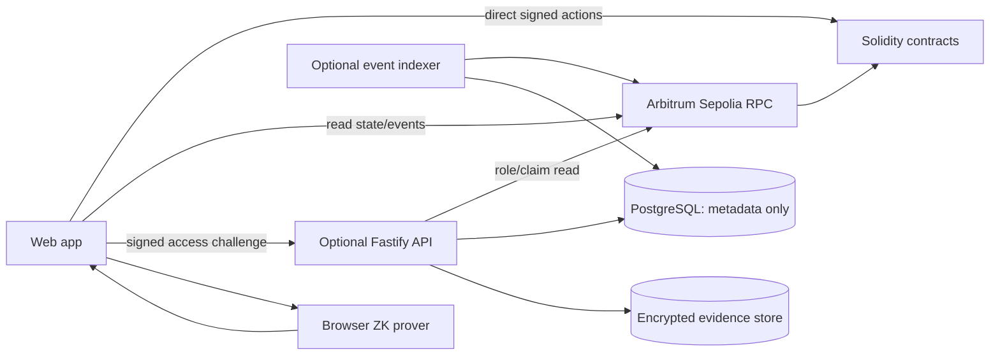

# Proof of Aid — Backend Architecture

## 1. Alignment with the main architecture

The contract is the source of truth for donations, milestone states, expense claims, role confirmations, deadlines, disputes, releases, and refunds. The prototype web app reads contract events directly; it does not need a database or event indexer for the core donor timeline.

The one backend-like service needed by the prototype is the **local evidence store** described in the main architecture. It serves simulated files only after a wallet proves access by signing a challenge. The service checks the wallet's on-chain role and whether that role is entitled to the specific claim. Contract transactions are always signed and submitted by the user's wallet.

The contract releases each milestone tranche to the NGO organizer. The NGO pays suppliers off-chain. Supplier, sender, receiver, engineer, and auditor roles are evidence verifiers only; a verifier's role never makes them a recipient of contract funds.

## 2. Trust boundaries and sources of truth

| Data | Source of truth | Backend/storage responsibility |
|---|---|---|
| Donations, cumulative funding ranges, balances, tranche release, freezes/refunds | Smart contract | No prototype database; optional projection in the full system |
| Milestone and expense state, role confirmations, policy, deadlines | Smart contract | Read for authorization and display; never override contract state |
| Wallet roles, organization ID, and reputation counters | On-chain role registry, assigned by admin in prototype | Read to decide evidence access and show public reputation; real-world identity check is an off-chain admin assumption |
| Public project descriptions | Static fixture/local metadata in prototype; metadata DB in full system | Serve descriptive fields, not financial truth |
| Impact evidence files | Local simulated file store in prototype; encrypted object storage in full system | Restrict reads according to the visibility matrix in `ARCHITECTURE (1).md` |
| Support-cost line items and salt | Organizer/auditor private workspace | Must not be uploaded to the API, logged, or put on-chain |
| Support-cost commitment and proof result | Public commitment and contract verifier result | Store only public references if needed; contract decides validity |
| Dispute category and approved program evidence | Restricted store for authorized reviewers; no child case evidence is accepted | Public chain stores only generic reason category/hash and resolution |

A valid wallet signature proves address control, not legal identity. A file hash proves bytes have not changed since registration, not that the file was truthful when submitted.

## 3. Prototype: local evidence store

### Behavior

1. Evidence files are simulated and kept in a local directory or local-only storage adapter. This prototype store is not the encrypted per-file-key system planned for production.
2. The client asks the store for access to a specific evidence file and receives a one-time challenge bound to the file/claim, wallet, chain, nonce, and expiry.
3. The wallet signs the challenge. The store verifies the signature and checks the wallet's role and organization against the on-chain role registry and the claim's policy/state.
4. The store serves the file only to an entitled wallet. It does not expose filesystem paths or allow public directory listing.
5. Access checks mirror the main visibility matrix: organizer can access project evidence; a verifier only the claims their role must review; the auditor the private support-cost line items; the arbitrator only when reviewing a dispute; donors and unrelated third parties cannot retrieve private files. Publicly published evidence is a separate explicit case.

The role check in the local store is an access gate for the demo, not a substitute for user authentication, production encryption, or contract authorization.

### Minimum local API

| Method | Path | Purpose |
|---|---|---|
| `POST` | `/api/evidence/:evidenceId/challenge` | Return a short-lived single-use challenge after checking that the file exists |
| `POST` | `/api/evidence/:evidenceId/access` | Verify the signed challenge, read on-chain roles/claim policy, and return the authorized file |

Bind each challenge to the exact wallet, evidence ID, claim ID, chain ID, nonce, issue time, and expiry. Reject replay, wrong-domain, expired, mismatched-wallet, or unauthorized-role requests. Never accept a wallet address in the request as proof without recovering it from the signature.

### Prototype exclusions

- No API for donation, milestone start, evidence hash registration, verifier confirmation/rejection, proof submission, overdue marking, dispute, arbitration, release, or refund. The user wallet sends each transaction directly to the contract.
- No backend ZK prover. The support-cost circuit runs in the browser; the auditor signs commitment `C` after reviewing the private invoices.
- No PostgreSQL or chain event indexer requirement. The frontend reads Arbitrum Sepolia events directly.
- No server-held wallet keys or vendor payout facility.

## 4. Full-system backend

If Proof of Aid grows beyond the prototype, a modular backend can provide:

- **API:** Node.js + TypeScript + Fastify, versioned under `/api/v1`.
- **Database:** PostgreSQL for project descriptions, organization profiles, evidence references, access grants, dispute workflow notes, and optional event projections. Contract financial data stays authoritative.
- **Evidence storage:** private encrypted object storage. Encrypt each file with its own key and share that key only with wallets entitled under the access policy. IPFS is appropriate only for client-encrypted content whose permanence is acceptable.
- **Chain access:** viem public client for reads and optional indexing. A relayer is excluded unless its separate trust and authorization model is defined.
- **Workers:** optional chain indexer and notification worker. No hosted prover by default; moving private inputs to a server would change the privacy model.

The full backend does not make supplier payments. It does not accept safeguarding incident reports, referrals, or child case data; those remain in the NGO’s separate approved system. NGO supplier settlements occur through the NGO's external payment process and may be reported as off-chain evidence.

## 5. Full-system component diagram



The API authorizes access to off-chain material only. It cannot declare a milestone verified or make a contract action succeed.

## 6. Optional full-system modules and domain model

- **Wallet access:** challenge issuance, signature recovery, replay protection, and role/claim-based file authorization.
- **Metadata:** project descriptions and milestone text linked to `(chainId, contractAddress, projectId, milestoneId)`.
- **Evidence registry:** private object references, evidence hash, visibility class, allowed role/claim, retention and access audit.
- **Dispute workspace:** private notes/evidence exchange for donor, required verifier, and arbitrator according to the visibility policy.
- **Event indexer:** searchable projection for larger donor timelines and notifications; not required for the prototype.

```text
Organization
  id, publicName, registeredWallets[], createdAt

EvidenceRecord
  id, projectId, milestoneId, expenseId, evidenceHash, visibilityClass,
  allowedRole, encryptedObjectKey, createdAt, retentionUntil

AccessChallenge
  nonce, wallet, evidenceId, claimId, chainId, expiresAt, usedAt

PrivateReview
  expenseId, reviewerWallet, role, decision, privateNotesRef, createdAt

DisputeCase
  milestoneId, openedBy, reasonHash, privateDetailsRef, state,
  resolutionTxHash, createdAt, resolvedAt

ChainEventProjection (full system only)
  chainId, contractAddress, txHash, logIndex, blockNumber, blockHash,
  eventName, payload, confirmations, canonical
```

Do not store support-cost line items, salt, witness, seed phrases, private keys, or child/family identity or case information in any platform database or logs. No user role can bypass this prohibition. The public commitment/proof can be indexed, but its contract verification result is authoritative.

## 7. Full-system APIs

These are future metadata/evidence services, not requirements for core contract operations.

| Method | Path | Purpose |
|---|---|---|
| `POST` | `/api/v1/auth/challenge` | Issue a one-time wallet challenge for a private workflow |
| `POST` | `/api/v1/auth/session` | Optional session after wallet signature verification |
| `GET` | `/api/v1/projects` | List public project descriptions plus optional indexed summary |
| `POST` | `/api/v1/projects` | Create/update a project metadata draft |
| `GET` | `/api/v1/projects/:id` | Project description and linked public chain state |
| `POST` | `/api/v1/evidence/:id/access-challenge` | Create a file-specific role-gated challenge |
| `POST` | `/api/v1/evidence/:id/access` | Verify signature/entitlement and return a short-lived file grant |
| `GET` | `/api/v1/disputes/:id` | Read restricted dispute metadata for authorized parties |

Proof generation remains client-side. Funding, evidence registration, expense confirmations, support proof submission, milestone start/finalization, overdue marking, disputes, arbitration and refunds remain direct wallet-to-contract actions.

## 8. Access policy mapping

| File class | Allowed access in prototype |
|---|---|
| Public project/evidence explicitly published | Anyone |
| Impact evidence | Organizer; verifier wallets assigned to the relevant claim; arbitrator while resolving a dispute |
| Private support-cost invoices/line items | Organizer and assigned auditor; arbitrator only if essential to a dispute |
| Child-identifying or case-level data | Prohibited for every role; handled only in the NGO’s separate approved safeguarding system |
| Donor records | Public on-chain amounts and addresses; no private evidence by virtue of being a donor |

Check the full role/visibility matrix in `ARCHITECTURE (1).md` for every new file class. Default to denied access.

## 9. On-chain projection (full system only)

The optional indexer consumes the event vocabulary in `ARCHITECTURE (1).md`: project/donation creation, milestone release, evidence submission, expense confirmation/rejection, support-proof verification, milestone verification/overdue, dispute open/resolve, and refund claim.

- Deduplicate logs by `(chainId, txHash, logIndex)` and reconcile reorgs using block hashes.
- Preserve all confirmations, rejections and resolutions as append-only history.
- A tranche is released when the milestone starts; verifying milestone *k* unlocks milestone *k+1*.
- Deadline expiry alone does not change state. An eligible wallet must submit the overdue transaction.
- Refunds cover each donor's remaining allocation in locked/frozen milestone ranges; released funds cannot be clawed back.
- Contract state wins whenever an API projection differs.

## 10. Security and scope

- Prototype local evidence storage is for synthetic demo fixtures only; do not put any child or family information, safeguarding disclosures, referrals, case records, images, or identifying narratives in it. It is not a safeguarding case system.
- Full system requires TLS, encrypted object storage, per-file keys, short-lived grants, least privilege, and access audit.
- Reject expired/replayed signatures and validate chain/domain/evidence/claim binding.
- Never log raw documents, private inputs, salt, witness, wallet session tokens, or signed file URLs.
- Apply upload limits, content-type inspection, malware checks, retention and deletion policy in the full system.
- The prototype uses only an ERC-20 mock token on Arbitrum Sepolia and must not accept real funds.
- Keep this architecture linked to [the main architecture](<ARCHITECTURE (1).md>); it contains the canonical actor visibility matrix and contract state model.


## Child safeguarding boundary

Proof of Aid is a grant-accountability tool for an NGO dedicated to comprehensive child protection. It is not an intake channel, case-management system, investigation tool, or emergency service. Do not add API endpoints or upload categories for child disclosures, referrals, case files, contact details, photos, audio, precise location, or identifiable stories.

The local evidence store must contain synthetic fixtures only. Permitted artifact classes are approved safeguarding policies, redacted financial records, partner due-diligence summaries, training-completion attestations without participant identities, and non-identifying program-level audit attestations. Reject unsupported categories and make the prohibition visible at upload time. Filenames, metadata, logs, analytics, and dispute notes follow the same restriction.

The NGO’s separate approved safeguarding system remains the sole place for individual incident response, with trained staff and appropriate access/retention procedures. The platform may receive only a high-level, non-identifying attestation of process or program review. Aggregate reporting must suppress small groups and combinations of data that could re-identify a child.

Production readiness depends on the NGO’s safeguarding policy, designated focal point, safe reporting/response procedures, and staff/partner screening and training. See [Keeping Children Safe’s International Child Safeguarding Standards](https://www.keepingchildrensafe.global/international-child-safeguarding-standards/) and [UNICEF’s Safeguarding Policy](https://www.unicef.org/documents/safeguarding-policy).


## 11. Implemented backend starter

The initial implementation lives in `backend/` and provides a Fastify process, `GET /health`, and the two local evidence routes described above. The evidence registry is a static allowlist with one synthetic safeguarding-policy summary; there is no upload route. The API issues wallet-bound, chain-bound, short-lived single-use `personal_sign` challenges, recovers/verifies the wallet signature, and checks configured `hasRole(bytes32,address)` role IDs through viem before serving the fixture.

The starter fails closed if the synthetic fixture has been changed. It does not yet validate on-chain evidence registration/claim binding or active dispute state. Arbitrator access is denied until a live dispute-state reader is implemented. The repository has no deployed contract ABI or role IDs yet; configure these only after matching them to the deployed contract. Do not treat this role check as production authorization or as a substitute for the complete claim policy.
