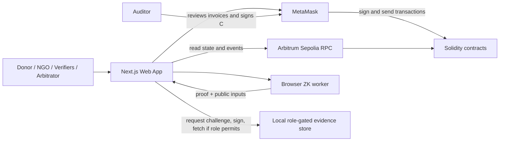

# Proof of Aid — Frontend Architecture

## 1. Alignment with the main architecture

The app supports donors, the NGO organizer, independent safeguarding/program verifiers, an auditor, and an arbitrator for an NGO dedicated to comprehensive protection of children against abuse. It is a funding-accountability interface, not a child-facing service, abuse-reporting channel, or case-management tool. Children and families have no accounts or portal in this design.

The frontend reads contract state/events directly from Arbitrum Sepolia and sends contract actions through the connected wallet. It runs the support-cost ZK circuit client-side. Private prototype files live in a simulated local store; a role-holder must sign a file-specific challenge before the store serves evidence. The full system encrypts each approved non-identifying program/financial artifact with its own key and shares that key only with authorized wallets. Child case records, disclosures, referrals, identifying images, and family data are prohibited everywhere in the platform.

The contract sends chained milestone tranches to the NGO. The NGO pays suppliers outside the contract. A supplier can be a verifier for relevant delivery evidence, never a contract payment recipient.

## 2. Proposed implementation

- **Framework:** Next.js App Router + React + TypeScript.
- **Wallet/chain:** wagmi + viem; MetaMask for the prototype, with a connector boundary for Privy if later selected.
- **Network/token:** Arbitrum Sepolia and ERC-20 mock token.
- **Contract state/events:** direct viem reads and event queries; no indexer required for the prototype.
- **ZK:** Proposed Circom/snarkjs support-cost circuit (confirm during implementation) in a browser Web Worker. Public inputs: commitment `C`, milestone budget and maximum share in basis points. Private inputs: support-cost line items and random salt. The auditor reviews the invoices and signs `C`.
- **Evidence:** local simulated file store with signed challenge and role checks in the prototype; encrypted per-file-key storage in the full design. Do not expose local filesystem paths or index/list files publicly.
- **Optional API:** only for local evidence access, public metadata or (later) storage grants. It does not relay user transactions or run the proof in the current design.

Wallet, browser storage, file selection, challenge signatures, and proof generation belong in client-only components. [Next.js App Router](https://nextjs.org/docs/app). viem separates read clients from wallet clients used for signed actions. [viem clients](https://viem.sh/docs/clients/intro).

## 3. Application diagram



The local evidence store is a file-access service, not a transaction proxy. It verifies a signed, single-use challenge and checks on-chain role/claim entitlement before returning a private file.

## 4. Navigation

```text
/                         Project discovery
/projects                 Public projects
/projects/[projectId]     Milestones, donations and public audit trail
/donations                Donor's allocation across milestone funding ranges
/organizer                NGO dashboard and active tranche
/organizer/projects/new   Create ordered milestones
/organizer/projects/[id]  Evidence, expense claims, ZK proof and dispute response
/verify                   Work queue filtered by assigned role
/verify/expenses/[id]     Review shared evidence and confirm/reject its hash
/audit/support-costs/[id] Auditor-only invoice review and signature of C
/disputes                 Donor dispute and arbitrator queue
/disputes/[id]            Restricted dispute review and resolution
/account                  Wallet, network and assigned roles
```

The prototype can use an admin-configured wallet registry with no admin UI. A child or beneficiary portal is out of scope. Individual case handling remains in the NGO’s separate approved safeguarding system.

## 5. Role workflows

### Donor

- Browse public project, milestone budgets/states, impact-expense amounts/hashes, role confirmations, dispute hashes and transaction history without connecting.
- Connect wallet to donate, dispute a project, or reclaim eligible locked funds.
- See the donor's exact allocation range across milestones, including donations split across two milestones.
- See locked, released-unverified, released-verified, frozen and refunded amounts distinctly.
- Do not grant donors access to private evidence merely because they funded the project. Donor rights are actions, not extra visibility.

### NGO / project organizer

- Configure milestones around safeguarding readiness, safe referral capability, prevention/family-support program delivery, and independent program/financial review. Do not report individual cases or low-count outcomes.
- Upload only approved, redacted organizational and financial artifacts. The upload flow must warn against and reject child-identifying material, disclosures, referrals, images, precise locations, and case records.

- Create project and ordered budgets; start milestone 1 after its budget is funded. The contract releases that tranche to the NGO.
- Upload impact evidence to the local store, register its hash on-chain, and make evidence explicitly public only after checking it contains no private data.
- Declare expense claims and show the policy roles required to confirm each evidence hash.
- Generate support-cost ZK proof in the browser. Keep line items and salt private.
- Share private support-cost invoices with the assigned auditor through the gated file-access flow; submit auditor-signed commitment `C` and proof to the contract.
- Pay suppliers through the NGO's normal off-chain channels. Supplier receipts remain evidence and are not contract payout instructions.
- Milestone *k* verification unlocks the next tranche; it does not pay milestone *k* a second time.

### Verifier

- Review process-level safeguarding readiness and non-identifying program attestations. Never request or receive individual child case records through this app.

- See only expense claims for assigned role(s), and retrieve only evidence the role is entitled to inspect.
- Request an access challenge, sign it with the assigned wallet, then fetch that specific file.
- Confirm/reject the exact evidence hash on-chain. Required confirmations must come from different wallets and different organizations.
- Rejection opens dispute flow; show remaining locked funds and pending consequences before transaction.
- Auditor role has access to private support-cost documents and signs commitment `C` after review.

### Arbitrator

- Access private claim files only while they are essential to an active dispute.
- Review public history, prior confirmations/rejections, and permitted private evidence.
- Resolve through arbitrator wallet. Valid resolution unfreezes remaining funds; invalid resolution allows pro-rata refunds of locked allocation.
- Preserve earlier claims and decisions in the timeline.

### NGO program partner

A partner organization may attest to an organizational or program-level milestone using its assigned role. It must never submit a child’s identity, case details, disclosure, referral, image, voice, or identifying story. Individual child participation and case confirmation are out of scope.

## 6. Visibility and private file access

Follow the canonical matrix in [the main architecture](<ARCHITECTURE (1).md>):

- Public chain state, donation amounts/addresses, impact-expense type/amount/hash, role confirmations, dispute/reason hashes, and reputation are visible to anyone.
- Impact evidence files are available only to the organizer, the verifier whose role requires the claim, or the arbitrator during a dispute, unless organizer explicitly publishes the file.
- Support-cost line items are available to the organizer and auditor; the arbitrator only when essential to a dispute.
- Child-identifying information and case-level data are prohibited throughout the platform, including for the NGO, verifiers, and arbitrator. The NGO handles individual cases in a separate approved safeguarding system.
- Donors have dispute/refund rights but no additional private-file visibility.

Prototype file access flow:

1. User chooses a file they are entitled to inspect.
2. Store issues a single-use challenge bound to wallet, file, claim, chain ID, nonce, and expiry.
3. Wallet signs; store verifies signature, checks role/organization and policy against the contract, and returns only that file.
4. UI shows the evidence hash and private/public label; it never exposes filesystem path or persistent public URL.

The local store simulates this gate but is not a production security boundary. Full system encrypts each file with its own key and shares the key only with authorized wallets.

## 7. Contract state and donor timeline

```text
Project: CREATED -> FUNDING -> ACTIVE -> COMPLETED / DISPUTED

Milestone: LOCKED -> RELEASED -> EVIDENCE_SUBMITTED -> VERIFIED
                       |                 |
                       +-----------------+-> DISPUTED -> RESOLVED_VALID / RESOLVED_INVALID

Funding: start milestone 1 releases its tranche to the NGO;
         verify milestone k to unlock tranche k+1.
```

The timeline separates: (1) tranche released to NGO, (2) milestone evidence/policy status, and (3) next tranche locked or unlocked. Refundable balance is derived by intersecting the donor's cumulative donation range with the remaining locked/frozen milestone ranges; never assume lifetime donation percentage is the exact pro-rata allocation.

Use integer token base units (`bigint`) for funding-range and refund calculations. Show transaction, block/time, and relevant event. If an RPC call fails, display “unavailable,” not zero.

## 8. Frontend modules

```text
src/
  app/                         Next.js routes/layouts
  components/
    wallet/                    Connect/network/account/transaction status
    timeline/                  Donation allocation and append-only events
    evidence/                  File privacy label, challenge signing and fetch
    expenses/                  Expense type/hash/required policy roles
    auditor/                    Private support-cost review and C signature
    disputes/                   Donor dispute and arbitrator resolution
  features/
    projects/                   Contract reads and metadata
    donations/                  ERC-20 approval/contribution/refund calculation
    evidence/                   Local-store access challenge client and hashing
    zk/                         Circuit manifest, worker, proof calldata mapping
    roles/                      Wallet/org/role display and action guards
    disputes/                   Freeze/resolve/refund contract calls
  lib/
    chain/                      Arbitrum Sepolia config, ABI, viem clients
    api/                        Optional local evidence/metadata API client
    privacy/                    Redaction and evidence classification
    money/                      BigInt allocation and formatting
  workers/
    support-cost-prover.worker  Witness/proof generation off main thread
```

Keep contract ABI, chain ID, token decimals/address, role and policy definitions, circuit version, verification key, and public signal order in shared versioned manifests.

## 9. State ownership and transaction UX

| UI state | Source | Prototype behavior |
|---|---|---|
| Funding, project/milestone states, role registry/reputation, claim decisions, deadlines, disputes/refunds | Contract | Read Arbitrum Sepolia directly |
| Audit timeline | Contract events | Query configured deployment block; no backend indexer |
| Static project copy | Fixture or optional metadata API | Not authoritative for funds or verification |
| File bytes | Local role-gated store | Access only after signed challenge; never public-list files |
| Support-cost line items/salt/witness | Organizer/auditor browser memory/local secure workspace | Never send to API, analytics, URL, console, or chain |
| Proof | Browser worker | Hold only long enough to submit; discard witness/salt after proving |
| Pending transaction | Wallet/RPC receipt | Do not update financial state until confirmed |

1. Check active wallet, Arbitrum Sepolia, token/contract addresses, actor role, and contract preconditions.
2. Show action, amount, recipient, project/milestone, token, chain, and privacy effects.
3. Request ERC-20 approval and contribution as separate transactions.
4. Submit expense confirmations, auditor signature/proof, dispute, arbitration, overdue marking, and refund from the authorized wallet.
5. A deadline passing does not update contract state by itself. Show permissionless `markOverdue` action and flag overdue only after the transaction confirms.
6. Show pending hash, confirmations, receipt, rejection, revert, replacement or RPC error explicitly.

## 10. Errors, accessibility, and privacy

- Labels and text accompany colors for locked/released/verified/frozen/refunded/overdue/disputed.
- Provide keyboard operation, semantic form labels and screen-reader status announcements.
- Wrong network: offer explicit switch to Arbitrum Sepolia; never silently submit elsewhere.
- Missing verifier role: name the required role/organization, without making private evidence public.
- Expired/replayed challenge: request a new one; do not cache signed challenges.
- Access denied: explain which role is required without confirming whether unrelated private files exist.
- Proof invalid: safe circuit error only, no private inputs.
- Distinguish `Proof generated`, `Auditor signed C`, `Proof accepted by contract`, and `Milestone verified`.
- State that ZK verifies the rule over inputs, while the auditor/verifiers provide real-world authenticity checks.

## 11. Prototype vs. full design

### Prototype

- Next.js pages for donor, NGO, verifier, auditor and arbitrator workflows needed for one sample project.
- MetaMask, Arbitrum Sepolia and ERC-20 mock token.
- Direct contract state/event reads and wallet-signed transactions.
- Browser support-cost proof, auditor signature, role-based impact expense confirmations, chained tranches, and dispute/refund path if deployed.
- Local simulated evidence store gated by wallet-signed challenge and role registry; no child-facing portal or case workflow.

### Full design

- Per-file encryption keys shared only with entitled wallets, persistent storage and audited access.
- PostgreSQL metadata/indexer, search, dashboards and notifications.
- Committee arbitration, published wallet attestations/credentials, additional circuits, multisig, and production security review. Child accounts and individual child confirmations remain out of scope.


## Child safeguarding in the user experience

- Do not provide a child-facing account, report-abuse form, referral form, chat, or case-management view. The interface must clearly state that it is not monitored for emergencies or safeguarding disclosures.
- Upload accepts only approved artifact classes: safeguarding policy, redacted invoice/financial record, partner due-diligence summary, training-completion attestation without participant identities, and non-identifying program audit. Show a pre-upload checklist and reject unsupported file categories where feasible.
- Donor dashboards show budgets, tranche states, verification roles, and aggregated program-level progress. Suppress small-group counts, rare events, precise locations/dates, and narratives that could identify a child or family.
- Dispute forms use generic reason categories and must not accept case narratives or identifying details. The NGO follows up on actual safeguarding incidents through its separate approved system.
- Never imply that a ZK proof establishes that an individual child was protected or received a service. It proves only that the committed support-cost total satisfies its configured limit.
